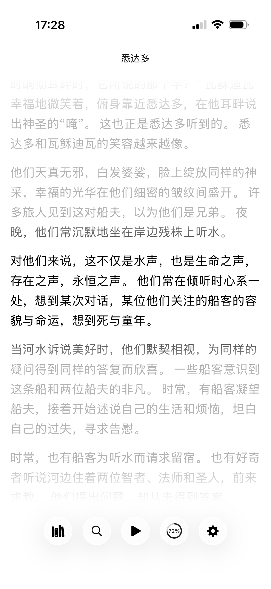

# TextReader for iOS

TextReader is a SwiftUI-based iOS application built for a focused text reading and narration experience. It lets you import, organize, read, and listen to plain-text content, with deep customization, background audio playback, and AI-assisted prompt workflows.

**App Store:** [读书派](https://apps.apple.com/cn/app/id6778748756)

> **Custom Prompt for AI** demo:
> https://github.com/user-attachments/assets/5b297d9c-38e1-41f1-996b-b519b604e81a

## Screenshot



## Features

### Core Reading & Narration
* **Paginated Reading** — Text is automatically split into easily navigable pages.
* **Text-to-Speech (TTS)** — Audio narration powered by `AVSpeechSynthesizer`, with play / pause control.
* **Customizable Narration**
    * **Voice Selection** — Choose from available system voices (optimized for Chinese voices).
    * **Speed Control** — Adjust narration speed (1.0x, 1.5x, 1.75x, 2.0x, 3.0x).
* **Sleep Timer** — Long-press the Play button to reveal a radial timer picker and auto-stop narration after a set number of minutes.
* **Background Playback** — Keep listening while the app is backgrounded or the device is locked (`audio` background mode).
* **Remote Controls** — Play / pause and next / previous page via headphones or Control Center (`MPRemoteCommandCenter`).
* **Now Playing Integration** — Shows the current book title, page, and controls on the lock screen and in Control Center.
* **Dark Mode** — Switch between light and dark themes, with the choice persisted.

### Book Management & Import
* **Multiple Import Methods**
    * **File Import** — Import `.txt` files via the system document picker (local storage or iCloud Drive). Supports UTF-8 and GBK / GB18030 encodings.
    * **Paste Text** — Create a book by pasting text. Title can be set manually or auto-generated from the first 10 characters.
    * **Share Sheet Import** — Receive text shared from other apps (Notes, Safari, etc.) through the iOS Share Extension, handling `public.plain-text` and `public.text`. Shared items are exchanged via an App Group inbox.
    * **Wi-Fi Transfer** — Push `.txt` files from a computer on the same network through an in-app web interface.
* **Book Library**
    * Lists all imported and built-in books.
    * Sorts by last-accessed time, surfacing the most recently opened book first.
    * Shows last-accessed time in friendly form (e.g. "Read just now", "Read 5 minutes ago").
* **Progress Persistence** — Automatically saves current page and total pages per book.
* **Built-in Book** — Ships with a "User Guide" (使用说明.txt) as a default book.

### Search & Navigation
* **Full-Text Search** — Search within the currently open book.
    * **Live Search** — Results update as you type.
    * **Keyword Highlighting** — Matched keywords are highlighted (yellow background, bold).
    * **Contextual Preview** — Each result shows a snippet with surrounding context.
    * **No Results State** — Displays a clear "No relevant content found" message.
* **Page Summaries** — When the search bar is empty, shows up to 100 equally spaced page snippets for quick navigation.
* **Interactive Page Slider**
    * Tap or drag the progress bar to reveal a slider for quick page jumps.
    * The slider auto-hides after 1.5 seconds of inactivity.
    * Long-press the progress bar for continuous dragging.
* **Haptic Feedback** — Subtle vibrations on page changes and other interactions.

### Advanced Text Interaction
* **"Big Bang" Word Segmentation**
    * Long-press the reading view to trigger word segmentation via `NLTokenizer`.
    * `BigBangView` renders tokens as selectable blocks.
    * Drag to select continuous tokens for copying.
* **Prompt Templates**
    * After selecting text in Big Bang view, apply a preset or custom template.
    * Placeholders `{selection}`, `{page}`, and `{book}` are substituted automatically.
    * The generated prompt is copied to the clipboard and can optionally open a Perplexity AI search.
    * Built-in defaults include "总结式" (summarize) and "翻译-EN" (translate to English); templates can be added, edited, and deleted.

### UI / UX Enhancements
* Tuned paragraph / letter spacing and a larger base font for readability.
* Linear progress bar for visual page tracking.
* Prominent circular Play / Pause button.
* Segmented speed selector for quick adjustments.
* Removed the startup title flicker for a smoother launch.

## Requirements

* **iOS** 26.0 or later
* **Xcode** 26.0 or later (for development)
* **macOS** 15.0 or later (for development with Xcode)

## Installation

1. **Clone the repository:**
    ```bash
    git clone https://github.com/your-repository-url/TextReader.git
    cd TextReader
    ```
2. **Open the project** — Open `TextReader.xcodeproj` in Xcode.
3. **Select a target** — Choose an iOS device or simulator.
4. **Build & run.**

You can also build, install, and launch directly from the command line:

```bash
make install
```

If multiple devices are connected, specify one explicitly:

```bash
make install DEVICE_NAME="KAI"
```

Other useful commands:

```bash
make help             # list available repository commands
make list-devices     # list connected devices
make list-simulators  # list available simulators
make run-simulator    # build and run on a simulator
make test             # run the test suite
```

## Usage Overview

* **Book List** — Tap the book icon in the navigation bar; select a book to start reading.
* **Importing** — Tap "+" in the book list to import via Files, Paste Text, or Wi-Fi Transfer.
* **Reading** — Tap the upper area for the previous page or the lower area for the next; use the progress slider to jump.
* **Narration** — Tap Play / Pause to control narration; long-press Play to set a sleep timer; adjust voice and speed in the control panel.
* **Search** — Tap the magnifying-glass icon to search within the current book.
* **Big Bang & Prompts** — Long-press text in the reader to segment words, select tokens, then use the Templates menu.
* **Dark Mode** — Toggle from the control panel.

## Key Technologies

* **SwiftUI** — Entire UI and app structure.
* **AVFoundation** — `AVSpeechSynthesizer` for TTS, `AVAudioSession` for audio session management.
* **MediaPlayer** — `MPRemoteCommandCenter` and `MPNowPlayingInfoCenter` for background control and lock-screen integration.
* **NaturalLanguage** — `NLTokenizer` for Big Bang word segmentation.
* **Network** — Powers the Wi-Fi file transfer service.
* **Combine** — Manages asynchronous events and state.
* **App Groups** — Shared inbox for handing off content from the Share Extension to the main app.
* **Core iOS Frameworks** — File management and persistence (`UserDefaults`, JSON for library metadata).

## Project Structure

```
TextReader/
├── Shared/                      # Code shared between app & extension (SharedImportStore)
├── TextReader/
│   └── TextReader/
│       ├── Application/          # App entry point (TextReaderApp)
│       ├── Managers/             # Library, Speech, Settings, AudioSession, Template
│       ├── Models/               # Book, BookProgress, PromptTemplate, AccentColor
│       ├── Services/             # SearchService, TextPaginator, Tokenizer, WiFiTransfer
│       ├── ViewModels/           # ContentViewModel (central orchestrator)
│       ├── Views/                # SwiftUI views (BookList, MainView, Search, BigBang, …)
│       ├── Resources/            # Built-in books (使用说明.txt)
│       └── Supporting Files/     # Utilities & entitlements
├── TextReaderExtension/          # Share Extension target
├── TextReaderTests/              # Unit tests
└── TextReaderUITests/            # UI tests
```

## Architecture

The app follows an **MVVM** design with clear separation of concerns:

* **ViewModel** — `ContentViewModel` is the central orchestrator between views and business logic.
* **Managers** — `LibraryManager`, `SpeechManager`, `SettingsManager`, `AudioSessionManager`, and `TemplateManager`, each with a single, well-defined responsibility.
* **Services** — `SearchService`, `TextPaginator`, and `WiFiTransferService` encapsulate discrete capabilities.
* **Persistence** — `LibraryManager` stores library metadata and reading progress as JSON; `SettingsManager` persists user preferences via `UserDefaults`; `TemplateManager` saves prompt templates to `templates.json`.
* **Organized layout** — Code is grouped into Models, ViewModels, Views, Services, and Managers for maintainability.

## Testing

Unit and UI tests live in `TextReaderTests/` and `TextReaderUITests/`, covering search composition state, the shared import flow, and core app behavior. Run them from Xcode (**Product ▸ Test**) or via `xcodebuild test`.

## License

This project is licensed under the MIT License. See the [LICENSE](LICENSE) file for details.

Copyright (c) 2024 KAI
